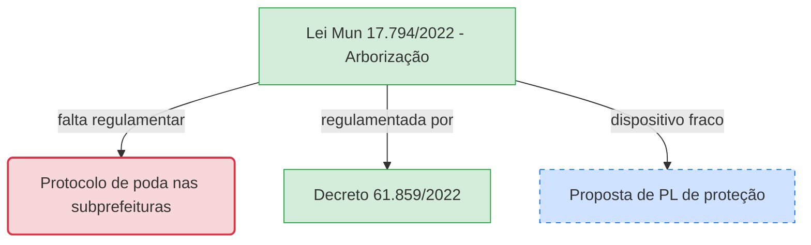

# Padrão Visual de Diagramas
<!-- id: diagram-style -->

Linguagem visual da malha regulatória: o diagrama Mermaid `flowchart TD` que fecha cada análise e o grafo interativo `d3graph` embutido na página. Ambos usam o mesmo código de cores.

## Cores por tipo de nó

Classes Mermaid que distinguem, à primeira vista, norma vigente, proposta e lacuna.

- **Norma municipal vigente:** verde — `fill:#d4edda,stroke:#28a745`.
- **Proposta de aperfeiçoamento (Eixo 2):** azul tracejado — `fill:#cfe2ff,stroke:#0d6efd,stroke-dasharray: 5 5`.
- **Lacuna, brecha ou alerta de fiscalização:** vermelho — `fill:#f8d7da,stroke:#dc3545`.
- **Lei federal:** retângulo de borda grossa — `stroke-width:3px`.

## Regras de construção

O fluxo é hierárquico, de cima para baixo, com a norma-semente no topo.

- Sempre `flowchart TD`.
- A norma que disparou a ingestão ocupa o topo.
- Rótulos de aresta curtos: `-->|altera|`, `-->|regula|`, `-->|lacuna textual|`, `-->|impacta|`.

## Exemplo

Bloco pronto para colar ao final do conteúdo principal da página da wiki.

## Grafo interativo (d3graph)

Quando a malha de uma lei fica densa demais para o diagrama estático, a skill `gerador-mapa-interativo-d3blocks` gera um grafo navegável em HTML autônomo com a biblioteca `d3blocks`.

**Dados de entrada.** Um `pandas.DataFrame` com as colunas `source`, `target` e `weight`. O peso codifica a força da relação:

- Conexão direta ou explícita (citação no texto ou hyperlink): `weight = 2.0`.
- Conexão indireta ou semântica (descoberta por embeddings): `weight = 1.0`.

**Estilo dos nós.** O tamanho é proporcional ao *in-degree centrality* (número de normas que citam o nó). As cores repetem a convenção de `Cores por tipo de nó`: verde para norma municipal vigente, vermelho para nó com lacuna ou alerta, azul para projeto de lei e norma futura. O slider de threshold fica habilitado para isolar as conexões fortes.

**Saída e embed.** O HTML é salvo em `wiki/assets/grafos/<nome-da-lei>.htm` — extensão `.htm`, não `.html` (ver nota abaixo). A página da lei em `wiki/legislacao/` embute o grafo logo após o diagrama Mermaid:

    <iframe src="../assets/grafos/<nome-da-lei>.htm" width="100%" height="600px" frameborder="0"></iframe>

**Por que `.htm` e não `.html`.** O Quartz (gerador do site publicado) remove a extensão `.html` de todo arquivo dentro de `content/` — a função `slugifyFilePath` trata `.html`, `.md` e "sem extensão" do mesmo jeito, achando que é mais uma página. O arquivo perdia a extensão no build e o navegador parava de reconhecê-lo como HTML dentro do `<iframe>`. `.htm` não está nessa lista e passa intocado. Ver `lat.md/publishing.md`.

