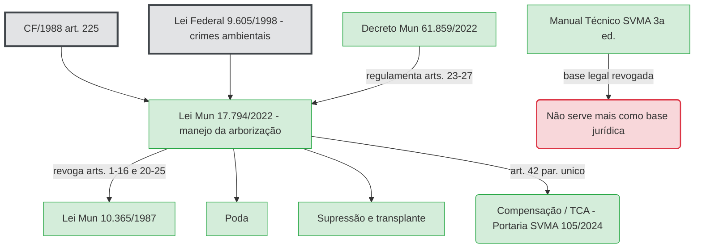

# Arborização urbana

**Resumo**: Conjunto da vegetação de porte arbóreo das vias e áreas verdes da cidade, tratada como floresta urbana e como bem de interesse comum. Toda intervenção depende de autorização prévia do poder público.

**Fontes**:
- raw/arborização/Arborização Manual Técnico de SVMA.pdf
- https://legislacao.prefeitura.sp.gov.br/lei-17794-de-27-de-abril-de-2022/consolidado
- https://legislacao.prefeitura.sp.gov.br/decreto-61859-de-3-de-outubro-de-2022/consolidado

**Última atualização**: 2026-09-10

---

## O Manual está desatualizado

O Manual Técnico de Arborização Urbana da SVMA (3ª edição) apoia-se na **Lei 10.365/1987**, cujos arts. 1º a 16 e 20 a 25 foram **revogados pela Lei 17.794/2022**, e em decretos de calçada já substituídos. A norma vigente de manejo é a **Lei 17.794/2022** (ver [[lei-17794-2022]]), regulamentada em parte pelo **Decreto 61.859/2022** (ver [[decreto-61859-2022]]). O que mudou:

| Tema | Manual / Lei 10.365/1987 | Lei 17.794/2022 |
|---|---|---|
| Norma de manejo | Lei 10.365/1987 | Lei 17.794/2022 (revoga arts. 1º-16 e 20-25 da 10.365) |
| "Árvore imune ao corte" | categoria do Decreto Estadual 30.443/1989 | substituída por **[[vegetacao-significativa]]** (Cap. II, arts. 4º-6º) |
| Poda em área privada | autorização prévia | **comunicação prévia** + laudo + ART (art. 18) |
| Poda em área pública municipal | autorização | **independe de autorização prévia** (art. 19) |
| Poda drástica | sem definição técnica no Manual | definida objetivamente (corte ≥ 1/3 da copa etc.) pela **Portaria SVMA 51/2024**, art. 2º, X |
| Plantio em área pública | — | **independe de autorização**; particular só comunica (art. 11) |
| Manejo de urgência | não sistematizado | Seção V (arts. 20-21): sem prévia autorização; risco de queda definido pela Portaria SVMA 51/2024 via NBR 16.246-3:2019; laudo pós-execução (parte suspensa por ADIN) |
| Hipóteses de supressão | Lei 10.365/1987, art. 11 (I-VII) | art. 14 (I-X), com III, VIII, IX suspensos por ADIN |
| Competência | SVMA / DEPAVE | **Subprefeitura** como regra; SVMA para casos sensíveis (Decreto 61.859/2022, arts. 2º-3º) |
| Profissional habilitado | eng. agrônomo | eng. agrônomo, eng. florestal **ou biólogo** (art. 8º, II) |
| Laudo técnico | — | conteúdo mínimo padronizado com georreferenciamento e ART (art. 9º) |
| Compensação / TCA | Portaria 130/2013 (revogada) | art. 42, § único → **Portaria SVMA 105/2024**, sobre a fórmula do **Decreto 53.889/2013** (ver [[portaria-svma-105-2024]], [[decreto-53889-2013]]) |
| Multas | Lei 9.605/1998 (genérica) | valores por espécime + dosimetria (Cap. IV, arts. 23-41) |
| Canal | processo físico | **Portal 156** (Decreto 61.859/2022, art. 5º) |
| Cadastro | SISGAU | **levantamento arbóreo decenal** (art. 3º) |
| Calçada / faixa livre | Decretos 45.904/2005 e 52.903/2012 | confirmados e ampliados pelo **Decreto 59.671/2020** (faixa livre 1,20 m + regra de 50% da largura) |
| Compensação por corte, seção 6.7 do Manual | Decreto 47.145/2006 | **revogado desde 2013** pelo Decreto 53.889/2013, art. 10 — divergência mais antiga que a da Lei 10.365/1987 |

A análise completa está em [[aplicar-ail-legislacao-arborizacao]] e [[questionar-criterios-tca]]. O restante desta página descreve o conteúdo técnico do Manual, que segue útil como referência de boa prática.

## Conceito

O trabalho de arborização de vias públicas e áreas verdes municipais adota o conceito de **Floresta Urbana**, surgido nos EUA e Canadá nos anos 1960: qualquer forma de vegetação nos espaços livres urbanos, por vezes conectada a fragmentos florestais próximos, formando uma rede ecológica (fonte: Arborização Manual Técnico de SVMA.pdf).

São Paulo tem cerca de 17.800 km de vias públicas, mais de 100 parques municipais e aproximadamente 5 mil praças (fonte: Arborização Manual Técnico de SVMA.pdf).

## Por que arborizar

Benefícios apontados pelo Manual (fonte: Arborização Manual Técnico de SVMA.pdf):

- Eleva a permeabilidade do solo; controla temperatura e umidade do ar; modera "ilhas de calor".
- Intercepta a água da chuva (retenção hídrica natural) e reduz erosão e enchentes.
- Proporciona sombra e reduz gastos públicos com pavimento e saúde.
- Funciona como corredor ecológico e abrigo de avifauna.
- Barreira contra ventos, ruídos e luminosidade excessiva.
- Retém particulados e reduz a poluição do ar.
- Sequestra e armazena carbono.
- Bem-estar psicológico e valorização estética.

## Base legal (conforme o Manual)

- **Constituição Federal de 1988, art. 225** — direito ao meio ambiente ecologicamente equilibrado; dever do Poder Público e da coletividade de defendê-lo (fonte: Arborização Manual Técnico de SVMA.pdf).
- **Lei Municipal 10.365/1987, art. 1º** — "considera-se como bem de interesse comum a todos os munícipes a vegetação de porte arbóreo..." (fonte: Arborização Manual Técnico de SVMA.pdf). Ver [[lei-10365-1987]]. **Revogado** — o equivalente vigente é o art. 1º da Lei 17.794/2022: "bem especialmente protegido, de interesse de todos os munícipes" (fonte: lei-17794-...-2022/consolidado).
- **Lei Federal 9.605/1998** ("Lei de Crimes Ambientais") — a má execução de manejo é infração ambiental (fonte: Arborização Manual Técnico de SVMA.pdf).
- Todo manejo arbóreo depende de **autorização prévia** da Prefeitura (fonte: Arborização Manual Técnico de SVMA.pdf).

## Gestão

Ferramenta de gestão citada: **SISGAU — Sistema de Gerenciamento de Árvores Urbanas** (fonte: Arborização Manual Técnico de SVMA.pdf). `[verificar]` situação atual e relação com o Plano Municipal de Arborização Urbana (PMAU).

O Manual foi publicado pela SVMA e pela Secretaria Municipal das Subprefeituras (SMSP), com respaldo na Portaria Intersecretarial 001/2011/SVMA/SMSP (fonte: Arborização Manual Técnico de SVMA.pdf).

## Planejamento

Três categorias, cada uma com parâmetros próprios de distanciamento e espécies (fonte: Arborização Manual Técnico de SVMA.pdf):

1. Arborização de passeios em vias públicas. Ver [[calcada-verde]].
2. Arborização de áreas livres públicas (praças, canteiros de avenidas, alças de viaduto, parques).
3. Arborização de áreas internas de lotes e glebas, públicas ou privadas.

A **Chave Arborizar** é a ferramenta de decisão: a partir de aspectos físicos do local (largura da calçada, rede elétrica aérea, recuo do imóvel, tipo de via) indica se é viável plantar e qual tabela de espécies usar, priorizando espécies de maior porte (fonte: Arborização Manual Técnico de SVMA.pdf).

## Ponto de atenção — Legística (Eixo 1)

Antes de usar qualquer parte técnica do Manual como base de fiscalização, confronte o dispositivo com a **Lei 17.794/2022**, o **Decreto 61.859/2022** e a **Portaria SVMA 105/2024** (tabela no topo desta página). O Manual serve como referência de boa técnica; não serve mais como base jurídica. Ver [[aplicar-ail-legislacao-arborizacao]] e [[questionar-criterios-tca]].

## Diagrama



## Bloco Cypher

```cypher
MERGE (n1:Norma {id: "MUN_LEI_10365_1987", tipo: "Lei", numero: "10365", ano: "1987", esfera: "Municipal", ementa: "Vegetação de porte arbóreo como bem de interesse comum"})
MERGE (n2:Norma {id: "MUN_LEI_17794_2022", tipo: "Lei", numero: "17794", ano: "2022", esfera: "Municipal", ementa: "Código de Arborização Urbana do Município de São Paulo"})
MERGE (n3:Norma {id: "FED_LEI_9605_1998", tipo: "Lei", numero: "9605", ano: "1998", esfera: "Federal", ementa: "Lei de Crimes Ambientais"})
MERGE (n4:Norma {id: "FED_CF_1988", tipo: "Constituição", numero: "1988", ano: "1988", esfera: "Federal"})
MERGE (o1:Orgao {nome: "SVMA"})
MERGE (c1:Conceito {termo: "Manejo arbóreo"})
MERGE (c2:Conceito {termo: "Floresta urbana"})
MERGE (n2)-[:REVOGA]->(n1)
MERGE (n4)-[:IMPACTA_INDIRETAMENTE]->(c1)
MERGE (n3)-[:IMPACTA_INDIRETAMENTE]->(c1)
MERGE (n1)-[:VINCULADO_A]->(c1)
MERGE (o1)-[:FISCALIZA]->(c1)
MERGE (n1)-[:IMPACTA_INDIRETAMENTE]->(c2);
```

## Páginas relacionadas

- [[lei-17794-2022]]
- [[decreto-61859-2022]]
- [[portaria-svma-51-2024]]
- [[decreto-53889-2013]]
- [[vegetacao-significativa]]
- [[manejo-arboreo]]
- [[poda]]
- [[calcada-verde]]
- [[compensacao-ambiental]]
- [[lei-10365-1987]]
- [[aplicar-ail-legislacao-arborizacao]]
- [[questionar-criterios-tca]]
- [[questionar-criterios-tca]]
