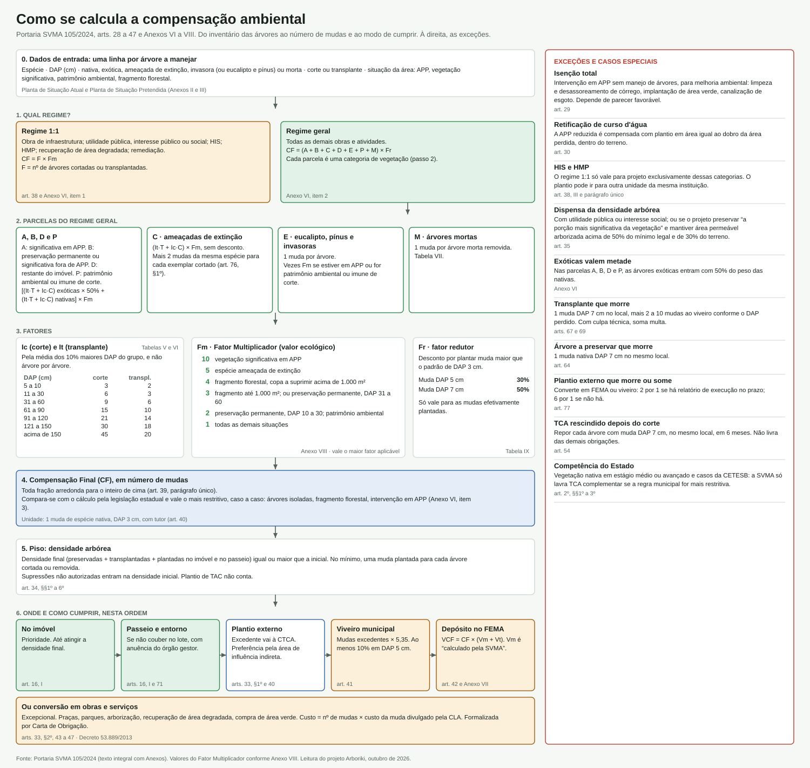

---
tags:
  - tipo/analise
  - esfera/municipal
  - eixo/1-legislacao-atual
  - conceito/compensacao-ambiental
  - conceito/tca
  - conceito/area-de-preservacao-permanente
  - conceito/supressao
---

# Cálculo da compensação ambiental

**Resumo**: Passo a passo do cálculo da compensação pela Portaria SVMA 105/2024 — do inventário das árvores ao número de mudas e ao modo de cumprir — com as exceções, um roteiro para recalcular a conta a partir de dados e a lista dos pontos em que o texto não permite um resultado único.

**Fontes**:
- raw/legislacao/Portaria SVMA 105-2024_anexos completos.pdf (arts. 28 a 47, 64 a 77 e Anexos VI a VIII)
- raw/legislacao/Decreto Municipail 53.889-2013.pdf (arts. 4º, 5º e 7º)

**Última atualização**: 2026-10-01

---

## Infográfico

## O cálculo em seis passos

Fonte: Portaria SVMA 105/2024, nos dispositivos indicados.

1. **Regime.** Obra de infraestrutura, utilidade pública, interesse público ou social, HIS, HMP, PRAD e remediação usam `CF = F × Fm`, em que F é o número de árvores cortadas ou transplantadas (art. 38; Anexo VI, item 1). Todo o resto usa o regime geral.
2. **Parcelas do regime geral.** `CF = (A + B + C + D + E + P + M) × Fr` (Anexo VI, item 2):
   - A, B, D e P: `[(It_e·T_e + Ic_e·C_e) × 50% + (It_n·T_n + Ic_n·C_n)] × Fm` — exóticas (e) valem metade das nativas (n);
   - C (ameaçadas de extinção): `(It_ex·T_ex + Ic_ex·C_ex) × Fm`, mais 2 mudas da mesma espécie por exemplar cortado (art. 76, §1º);
   - E (eucalipto, pínus, invasoras): 1 por 1; vezes Fm se em APP, patrimônio ambiental ou imune de corte;
   - M (mortas): 1 por 1.
3. **Fatores.** `Ic` e `It` saem das Tabelas VI e V, pela **média aritmética dos 10% maiores DAP** do grupo. `Fm` sai do Anexo VIII (1 a 10; vale o maior aplicável). `Fr` reduz a conta quando se plantam mudas maiores (Tabela IX).
4. **Compensação Final.** Fração arredonda para cima (art. 39, parágrafo único). Compara-se com o cálculo estadual e vale o mais restritivo (Anexo VI, item 3).
5. **Piso de densidade.** Densidade arbórea final ≥ inicial; no mínimo uma muda por árvore cortada ou removida (art. 34).
6. **Cumprimento.** No imóvel; depois passeio e entorno; o excedente ("mudas para deliberação", art. 3º, X) vai à CTCA, que prefere plantio externo e pode converter em mudas ao viveiro (× 5,35), depósito no FEMA (`VCF = CF × (Vm + Vt)`) ou obras e serviços (arts. 33, 41 a 47).

| DAP (cm) | Corte (`Ic`) | Transplante (`It`) |
|---|---|---|
| 5 a 10 | 3 | 2 |
| 11 a 30 | 6 | 3 |
| 31 a 60 | 9 | 6 |
| 61 a 90 | 15 | 10 |
| 91 a 120 | 21 | 14 |
| 121 a 150 | 30 | 18 |
| acima de 150 | 45 | 20 |

| `Fm` | Situação (Anexo VIII) |
|---|---|
| 10 | vegetação significativa em APP |
| 5 | espécie ameaçada de extinção |
| 4 | fragmento florestal em regeneração, copa a suprimir > 1.000 m² |
| 3 | fragmento com copa ≤ 1.000 m²; ou vegetação de preservação permanente, DAP predominante 31 a 60 cm |
| 2 | vegetação de preservação permanente, DAP 10 a 30 cm; ou patrimônio ambiental (Decreto Estadual 30.443/1989) |
| 1 | demais situações |

## Exceções e casos especiais

| Caso | Regra | Dispositivo |
|---|---|---|
| Intervenção em APP sem manejo de árvores, para melhoria ambiental | pode ser isenta de compensação | art. 29 |
| Retificação de curso d'água | plantio em área igual ao dobro da APP reduzida | art. 30 |
| HIS e HMP | 1 por 1 só para projeto exclusivamente dessas categorias | art. 38, parágrafo único |
| Dispensa do piso de densidade | utilidade pública ou interesse social; ou preservação da "porção mais significativa" + área permeável arborizada > 50% do mínimo e ≥ 30% do terreno | art. 35 |
| Transplante que morre | 1 muda DAP 7 cm no local + 2, 3, 6 ou 10 mudas ao viveiro conforme o DAP | art. 67 |
| Árvore a preservar que morre | 1 muda nativa DAP 7 cm no local | art. 64 |
| Plantio externo que morre ou some | conversão em FEMA ou viveiro: 2 por 1 com relatório no prazo; 6 por 1 sem | art. 77 |
| TCA rescindido depois do corte | repor com DAP 7 cm, no local, em 6 meses | art. 54 |
| Plantio feito por TAC | não conta para o TCA | art. 34, §6º |
| Competência estadual (CETESB) | SVMA lavra TCA complementar só se a regra municipal for mais restritiva | art. 2º, §§1º a 3º |

## Roteiro para recalcular a conta a partir de dados

Para conferir o `CF` de um TCA real, são necessários, por árvore manejada:

| Variável | Tipo | Uso |
|---|---|---|
| `dap_cm` | número | classe das Tabelas V e VI; corte dos 10% maiores |
| `acao` | corte ou transplante | escolhe `Ic` ou `It` |
| `origem` | nativa, exótica, ameaçada, invasora (ou eucalipto/pínus), morta | parcela e desconto de 50% |
| `situacao_area` | APP, significativa, preservação permanente, patrimônio/imune, fragmento, demais | parcela (A, B, D, P) e `Fm` |

E por TCA: `regime` (geral ou 1:1), mudas plantadas por padrão (`n3`, `n5`, `n7`), densidade inicial e final, destino do excedente, `Vm` e `Vt` da data-base.

Passos: (1) separar as árvores por parcela e por nativa/exótica; (2) em cada grupo, tirar a média dos 10% maiores DAP e ler `Ic`/`It` na tabela; (3) multiplicar pelo número de árvores do grupo e por `Fm`; (4) somar as parcelas; (5) arredondar para cima; (6) conferir o piso de densidade; (7) abater as mudas maiores pelo `Fr`.

## Onde o texto não permite um resultado único

Estes pontos impedem a reprodução exata do cálculo e devem ser tratados como fonte de incerteza em qualquer inferência quantitativa.

- **Fronteiras de classe.** As tabelas vão de "5 a 10" para "11 a 30". Uma média de 10,5 cm não cai em nenhuma classe. O texto não diz se a média é arredondada antes.
- **Quantos são "10%".** Num grupo de 7 árvores, 10% é 0,7. O texto não diz se arredonda para 1, nem o que fazer com grupos pequenos.
- **Limiar do que é árvore.** A Lei 17.794/2022 fala em DAP **superior** a 5 cm; a Portaria 105, art. 3º, III, em DAP **igual ou superior** a 5 cm, "conforme" a mesma lei. Ver [[mapa-de-conceitos]].
- **`Fr` aparece de dois jeitos.** A fórmula geral multiplica a soma por `Fr`; o Anexo VII, item 2, define `Fr` como divisor por muda plantada (`x/0,7` para DAP 5 cm; `y/0,5` para DAP 7 cm). As duas formas só coincidem se todas as mudas forem do mesmo padrão.
- **`Fm` por árvore ou por área.** O Anexo VI diz que o fator "pode não ser único para todos os exemplares" e que, com mais de um enquadramento, vale o maior — sem dizer como partir o imóvel em zonas.
- **Cálculo estadual de comparação.** O Anexo VI manda comparar com "a legislação estadual", sem nomear a norma.
- **`Vm` não publicado.** "Calculado pela SVMA" (Anexo VII) e "divulgado pela CLA" (art. 44), sem fonte indicada. Ver [[decreto-64877-2025]].
- **Remissão interna errada.** O Anexo VI aponta o "ANEXO VII" como sede do Fator Multiplicador; a tabela está no Anexo VIII.
- **"Porção mais significativa da vegetação"** (art. 35, II) é definida caso a caso pela DCRA.

## Indicadores sugeridos

| Indicador | Como calcular | O que mostra |
|---|---|---|
| Razão de compensação | `CF` ÷ nº de árvores manejadas, por TCA | severidade efetiva; comparar com a faixa teórica de 1 a 450 |
| Diferença de recálculo | `CF` do TCA − `CF` recalculado | erro, discricionariedade ou regra não escrita |
| Peso do regime 1:1 | % de TCAs e % de árvores cortadas no regime 1:1 | tamanho do tratamento favorecido |
| Distribuição de `Fm` | frequência de cada valor | quanto da vegetação cortada é tratada como "demais situações" |
| Destino da compensação | % das mudas: lote, entorno, externo, viveiro, FEMA, obras | quanto da compensação vira árvore no local do dano |
| Efeito da média dos 10% | `CF` com a regra × `CF` árvore a árvore | se a regra reduz ou aumenta a conta em lotes heterogêneos |
| Valor por muda no FEMA | depósito ÷ `CF` convertido | `Vm + Vt` realmente praticado, por ano |

## Páginas relacionadas

- [[compensacao-ambiental]]
- [[ciclo-de-vida-do-tca]]
- [[termo-de-compromisso-ambiental-tca]]
- [[portaria-svma-105-2024]]
- [[decreto-53889-2013]]
- [[decreto-64877-2025]]
- [[questionar-criterios-tca]]
- [[mapa-de-conceitos]]
