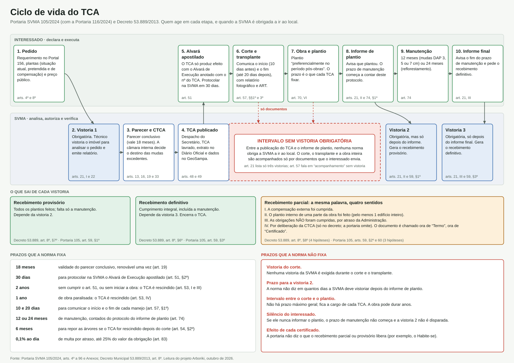

---
tags:
  - tipo/analise
  - esfera/municipal
  - eixo/1-legislacao-atual
  - eixo/2-aperfeicoamento
  - conceito/tca
  - conceito/manejo
  - conceito/supressao
  - conceito/compensacao-ambiental
---

# Ciclo de vida do TCA

**Resumo**: Etapas do Termo de Compromisso Ambiental, do pedido ao recebimento definitivo, com quem age em cada uma e quando a SVMA é obrigada a vistoriar. Mostra o intervalo sem vistoria entre a publicação do TCA e o informe de plantio, a ambiguidade do "recebimento parcial" e um dicionário de eventos para análise quantitativa de bases de TCA.

**Fontes**:
- raw/legislacao/Portaria SVMA 105-2024_anexos completos.pdf (arts. 4º a 96, com a redação da Portaria SVMA 116/2024)
- raw/legislacao/Decreto Municipail 53.889-2013.pdf (art. 8º, com a redação do Decreto 54.423/2013)
- https://legislacao.prefeitura.sp.gov.br/portaria-secretaria-municipal-do-verde-e-do-meio-ambiente-130-de-12-de-outubro-de-2013 (Portaria 130/2013, revogada — comparação histórica)

**Última atualização**: 2026-10-01

---

## Infográfico

## Etapas

Fonte de todas as linhas: Portaria SVMA 105/2024, no artigo indicado.

| # | Etapa | Quem age | Gatilho | Dispositivo | Vistoria da SVMA |
|---|---|---|---|---|---|
| 1 | Pedido, com plantas e preço público | Interessado | iniciativa própria | arts. 4º e 8º | — |
| 2 | Vistoria de análise do pedido | SVMA (GTMAPP) | pedido autuado | arts. 21, I e 22 | **obrigatória (1ª)** |
| 3 | Parecer conclusivo; deliberação da CTCA sobre o excedente | SVMA | vistoria e documentos | arts. 13, 16, 19 e 33 | — |
| 4 | Despacho autorizatório, lavratura do TCA, extrato no Diário Oficial, dados no GeoSampa | SVMA (Secretário, CLA) | compensação definida | arts. 48 e 49 | — |
| 5 | Alvará de Execução apostilado com o nº do TCA (condição de eficácia) | Interessado e órgão de obras | TCA publicado | art. 51 | — |
| 6 | Corte e transplante | Interessado, com responsável técnico | TCA eficaz | arts. 57 e 61 | **nenhuma exigida** |
| 7 | Obra e plantio compensatório | Interessado | cronograma do TCA | art. 70, VI | **nenhuma exigida** |
| 8 | Informe de finalização do plantio | Interessado | iniciativa própria | arts. 21, II e 74, §1º | **obrigatória (2ª)**, depois do informe |
| 9 | Manutenção e conservação: 12 ou 24 meses | Interessado | protocolo do informe | art. 74 | — |
| 10 | Informe de fim da manutenção | Interessado | iniciativa própria | art. 21, III | **obrigatória (3ª)**, depois do informe |

Ramos laterais: aditamento (art. 55), prorrogação (art. 53, §§2º-3º), rescisão (art. 53), manejo irregular (arts. 78 a 82), multa contratual (arts. 83 a 89), conversão em obras por Carta de Obrigação (arts. 43 a 47).

## Achado 1 — intervalo sem vistoria entre o TCA e o plantio

O art. 21 lista **três** vistorias obrigatórias: para analisar o pedido (I), "quando do informe de finalização de plantio compensatório" (II) e depois do prazo de manutenção, "após informe do interessado" (III). Nenhuma delas acontece entre a publicação do TCA e o informe de plantio.

Nesse intervalo ocorrem o corte, o transplante e a obra inteira. O controle previsto é documental:

- o interessado comunica o início e o fim de cada manejo, com relatório técnico fotográfico e ART (art. 57, §§1º e 3º);
- o manejo é acompanhado por profissional contratado pelo próprio interessado (art. 61);
- o art. 57 diz que a CLA "realizará o acompanhamento de cada manejo", mas não prevê vistoria, prazo nem relatório da SVMA para isso.

Consequências que o texto não resolve:

- **Ninguém da SVMA confere o corte.** Árvore cortada a mais, árvore a preservar danificada (art. 63) ou transplante malfeito só aparecem na vistoria 2, meses ou anos depois.
- **A vistoria 2 depende de um ato do fiscalizado.** Se o interessado não informa o plantio, a norma não dispara a vistoria. O art. 74, §2º só trata do fim do prazo de manutenção, que por sua vez só começa com o informe.
- **O relógio da manutenção corre da autodeclaração.** Os 12 ou 24 meses contam "a partir do protocolo da informação do plantio pelo interessado" (art. 74, §1º), não da vistoria que confirma o plantio.
- **Não há prazo para a SVMA vistoriar** depois do informe.
- **Não há prazo máximo geral entre o corte e o plantio.** O plantio é "preferencialmente no período pós-obras" (art. 70, VI) e o prazo é o que cada TCA fixar. As causas de rescisão do art. 53 medem o alvará e a obra, não o plantio.
- **Redação confusa do aviso de início.** O art. 57, §1º, "a" pede comunicação "com antecedência mínima de até 10 (dez) dias" — "mínima" e "até" se contradizem.

O Decreto 53.889/2013 não fecha a lacuna: o art. 8º, §5º também só manda vistoriar "após a comunicação pelo interessado do término de cada uma das atividades" (fonte: Decreto Municipail 53.889-2013.pdf).

Há um contrapeso: constatado manejo irregular durante o acompanhamento, o processo é suspenso e pode levar à rescisão (arts. 80 e 81). Mas a constatação depende de denúncia (art. 82) ou das vistorias 2 e 3.

## Achado 2 — "parcial" tem quatro sentidos e dois nomes

| Hipótese de recebimento parcial | Decreto 53.889/2013, art. 8º, §8º | Portaria 105/2024, art. 60 |
|---|---|---|
| I — compensação externa cumprida | sim | sim |
| II — plantio interno da parcela da obra a atestar (pelo menos 1 edifício inteiro) | sim | sim |
| III — obrigações **não** cumpridas, por atraso da Administração | sim | sim (depende da CTCA) |
| IV — "assim for deliberado" pela CTCA | sim | **omitida** |

Problemas:

- **A mesma palavra cobre situações opostas.** Nas hipóteses I e II algo foi cumprido; na III, o certificado é dado justamente porque não foi.
- **Parcial em relação a quê?** A norma não diz se o recebimento parcial é uma etapa antes do provisório, ou um recorte (de obrigação ou de edifício) que depois segue para provisório e definitivo. Também não diz se exige prazo de manutenção.
- **Dois nomes.** O art. 59, §2º fala em "Termo de Recebimento Parcial, Provisório e Definitivo"; os arts. 60 e 65 falam em "Certificado de Recebimento". O decreto usa "Certificado". O art. 47 usa "Termo de Recebimento Definitivo" para obras e serviços.
- **Decreto e portaria divergem.** O decreto admite a hipótese IV (deliberação livre da CTCA) e diz que quem emite os certificados é a CTCA (art. 8º, §§6º a 8º). A portaria omite a hipótese IV e não diz quem emite.
- **Efeito não declarado.** Nenhuma das duas normas diz o que cada certificado libera — por exemplo, o Certificado de Conclusão da obra. `[verificar]` no Código de Obras (Lei 16.642/2017) e nas normas de licenciamento de edificações.
- **Quem acompanha?** Pelo decreto, o acompanhamento do TCA é da CTCA (art. 8º, §3º); pela portaria, da CLA (art. 57) e a constatação é do GTMAPP (art. 59).

## Outras incoerências do texto que afetam o ciclo

- O art. 1º, IX remete ao "Artigo 143 da Lei 16.050/14" para a transferência de potencial construtivo. O art. 143 do PDE trata de CEPAC em operação urbana; a transferência está nos arts. 122 a 133, e a hipótese de TCA no art. 154, IV (fonte: lei-16050-...-2014/consolidado).
- O art. 2º cita duas vezes a "Resolução CONAMA nº 237, de 19 de dezembro de **1987**". A resolução é de 1997.
- O art. 2º, §1º, I cita "CONAMA nº 01/**1991**, Art. 2º §4º" no mesmo inciso em que cita a Resolução CONAMA 01/**1994**.
- O Anexo VI manda buscar o Fator Multiplicador no "ANEXO VII"; a tabela está no Anexo VIII.
- O art. 96 data a Portaria 130 de 26 de agosto de 2013; o portal a registra também como 12 de outubro de 2013.

## Subsídio para análise quantitativa

Esta seção descreve como um banco de TCAs deveria se comportar se a norma fosse cumprida, para que outro projeto possa medir desvios. Os nomes de campo são sugestões.

### Eventos e onde cada um fica registrado

| Evento | Campo sugerido | Base | Publicação prevista |
|---|---|---|---|
| Protocolo do pedido | `dt_pedido` | art. 4º | processo eletrônico |
| Vistoria de análise | `dt_vistoria_1` | art. 21, I | relatório no processo |
| Parecer conclusivo | `dt_parecer`, `validade_parecer` (+18 meses) | arts. 16 e 19 | processo |
| Despacho autorizatório | `dt_despacho` | art. 48 | **Diário Oficial** |
| Extrato do TCA | `dt_publicacao_tca`, `num_tca` | art. 49, § único | **Diário Oficial** e **GeoSampa** |
| Alvará apostilado protocolado | `dt_eficacia` | art. 51 | processo |
| Início e fim de cada manejo | `dt_inicio_manejo`, `dt_fim_manejo` | art. 57, §1º | processo (relatório + ART) |
| Informe de plantio | `dt_informe_plantio` | art. 74, §1º | processo |
| Vistoria de plantio | `dt_vistoria_2` | art. 21, II | relatório no processo |
| Recebimento provisório | `dt_receb_provisorio` | art. 59, §1º | `[verificar]` se é publicado |
| Recebimento parcial | `dt_receb_parcial`, `hipotese_parcial` (I a IV) | art. 60 | `[verificar]` |
| Informe de fim da manutenção | `dt_informe_final` | art. 21, III | processo |
| Vistoria final | `dt_vistoria_3` | art. 21, III | relatório no processo |
| Recebimento definitivo | `dt_receb_definitivo` | art. 59, §3º | obras: **Diário Oficial** (art. 47); plantio: `[verificar]` |
| Aditivo | `dt_aditivo` | art. 55, §1º | **Diário Oficial** |
| Prorrogação | `dt_prorrogacao` | art. 53, §3º | **Diário Oficial** |
| Rescisão | `dt_rescisao`, `motivo` (art. 53, I a V) | arts. 53 e 54 | **Diário Oficial** |
| Multa contratual | `dt_multa`, `valor_multa` | arts. 83 a 87 | **Diário Oficial** ("Comunique-se") |
| Carta de Obrigação | `dt_carta_obrigacao` | art. 45 | **Diário Oficial** |

O que só existe dentro do processo (comunicações de manejo, informes, relatórios de vistoria) exige consulta ao processo eletrônico ou pedido de acesso à informação.

### Regras que os dados devem obedecer

1. `dt_despacho` ≤ `dt_publicacao_tca` (art. 48).
2. `dt_publicacao_tca` ≤ `dt_eficacia` ≤ `dt_publicacao_tca` + 2 anos; passado disso, o TCA deveria estar rescindido (art. 53, I).
3. `dt_eficacia` ≤ `dt_inicio_manejo`. Manejo antes da eficácia é manejo irregular (arts. 78 a 80).
4. `dt_fim_manejo` ≤ `dt_informe_plantio` ≤ `dt_vistoria_2` ≤ `dt_receb_provisorio`.
5. `dt_receb_definitivo` ≥ `dt_informe_plantio` + 12 meses (ou + 24 meses, se reflorestamento) (art. 74).
6. Todo TCA com `dt_receb_definitivo` tem `dt_vistoria_3` (art. 59, §3º).
7. `hipotese_parcial` = III ou IV implica deliberação da CTCA registrada (art. 60, parágrafo único; Decreto 53.889, art. 8º, §8º).

### Indicadores para testar a suspeita de fragilidade

| Indicador | Como calcular | O que mostra |
|---|---|---|
| Duração do intervalo sem vistoria | `dt_informe_plantio` − `dt_publicacao_tca` (mediana, percentis) | por quanto tempo o corte fica sem verificação presencial |
| TCAs em aberto | TCAs sem `dt_receb_provisorio`, por idade (> 2, > 5, > 10 anos) | compromissos que talvez nunca foram verificados |
| Déficit arbóreo no tempo | Σ (árvores cortadas × anos entre `dt_fim_manejo` e `dt_informe_plantio`) | "árvores-ano" sem reposição |
| Tempo de resposta da SVMA | `dt_vistoria_2` − `dt_informe_plantio` | prazo que a norma não fixa |
| Peso do recebimento parcial | % de TCAs com `dt_receb_parcial`; distribuição por hipótese I a IV | uso real de cada sentido de "parcial" |
| Parciais que nunca viram definitivos | TCAs com parcial e sem definitivo, por idade | se o parcial funciona como quitação de fato |
| Rescisão depois do corte | TCAs com `dt_rescisao` > `dt_inicio_manejo` | casos do art. 54; conferir se houve reposição em 6 meses |
| Multas por atraso | nº e valor das multas ÷ nº de TCAs com prazo vencido | se a sanção do art. 83 é aplicada |
| Aditivos por TCA | contagem de `dt_aditivo` | instabilidade do compromisso depois de firmado |

`[verificar]` quais desses eventos constam da base aberta de TCAs (pendência nº 1 de [[verificacoes-pendentes]]).

## Propostas — Eixo 2

1. Tornar obrigatória uma vistoria da SVMA ao fim do corte e do transplante, antes do início da obra.
2. Fixar prazo para a SVMA vistoriar depois de cada informe.
3. Fixar prazo máximo entre o fim do manejo e o plantio, com rescisão ou multa automática.
4. Contar a manutenção a partir da vistoria que confirma o plantio, não do protocolo do informe.
5. Definir "recebimento parcial" com um único sentido, dar outro nome à hipótese de atraso da Administração e declarar o efeito de cada certificado.
6. Alinhar decreto e portaria: mesma lista de hipóteses, mesmo nome do documento, mesmo órgão emissor.
7. Publicar no Diário Oficial e no GeoSampa todos os recebimentos (parcial, provisório e definitivo).

Ver a auditoria completa em [[questionar-criterios-tca]].

## Páginas relacionadas

- [[termo-de-compromisso-ambiental-tca]]
- [[calculo-da-compensacao]]
- [[portaria-svma-105-2024]]
- [[decreto-53889-2013]]
- [[questionar-criterios-tca]]
- [[mapa-de-conceitos]]
- [[verificacoes-pendentes]]
