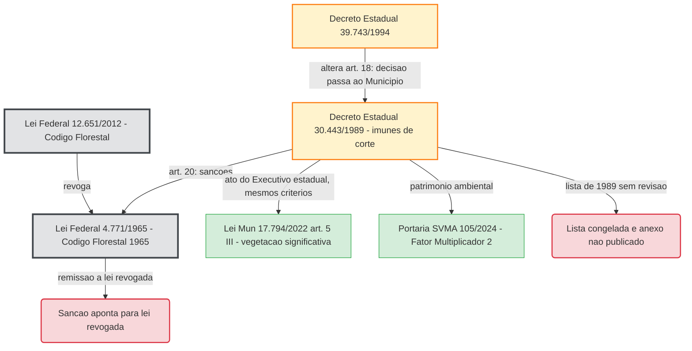

---
tags:
  - tipo/decreto
  - esfera/estadual
  - situacao/vigente
  - eixo/1-legislacao-atual
  - conceito/vegetacao-significativa
  - conceito/imune-de-corte
  - conceito/patrimonio-ambiental
  - conceito/macico-arboreo
  - conceito/manejo
  - conceito/supressao
---

# Decreto Estadual 30.443/1989 — Árvores imunes de corte em São Paulo

**Resumo**: Decreto do Governo do Estado que declara "patrimônio ambiental" os exemplares arbóreos do documento *Vegetação Significativa do Município de São Paulo* e torna imunes de corte as árvores de centenas de parques, praças, bairros, lotes e exemplares isolados da capital. Alterado pelo Decreto Estadual 39.743/1994, que passou ao Município a decisão sobre o corte excepcional.

**Fontes**:
- raw/legislacao/Decreto Estadual 30.443-1989.pdf (cópia do repositório da ALESP)
- https://www.al.sp.gov.br/repositorio/legislacao/decreto/1989/decreto-30443-20.09.1989.html
- https://www.al.sp.gov.br/repositorio/legislacao/decreto/1994/decreto-39743-23.12.1994.html

**Última atualização**: 2026-09-23

---

## Identificação

- **Número**: Decreto Estadual 30.443, de 20/09/1989 (retificado no D.O. de 21/09/1989)
- **Texto oficial**: [Repositório de legislação da ALESP](https://www.al.sp.gov.br/repositorio/legislacao/decreto/1989/decreto-30443-20.09.1989.html) · [Decreto Estadual 39.743/1994, que o altera](https://www.al.sp.gov.br/repositorio/legislacao/decreto/1994/decreto-39743-23.12.1994.html)
- **Autoria**: Governador Orestes Quércia (Poder Executivo do Estado de São Paulo)
- **Status**: vigente — alterado no art. 18 pelo Decreto Estadual 39.743/1994. Nenhuma revogação registrada no repositório da ALESP (fonte: al.sp.gov.br/repositorio/.../decreto-30443-20.09.1989.html). `[verificar]` a ficha completa da norma (`al.sp.gov.br/norma/{id}`) para confirmar que não há revogação posterior.
- **Instância**: Governo do Estado de São Paulo

## O que propõe

Fonte de todos os itens: Decreto Estadual 30.443-1989.pdf.

- **Art. 1º** — declara **patrimônio ambiental** os exemplares arbóreos classificados no documento **"Vegetação Significativa do Município de São Paulo"**, anexo ao decreto e depositado na Secretaria (estadual) do Meio Ambiente.
- **Arts. 2º a 16** — declaram **imunes de corte**, por localização, beleza, raridade ou condição de porta-sementes, as árvores de:
  - **parques e reservas** (art. 2º) — Cantareira, Ibirapuera, Aclimação, Carmo, Luz, Trianon, Fontes do Ipiranga, entre outros;
  - **praças e espaços urbanos** (art. 3º) — Praça da República, Largo do Arouche, Vale do Anhangabaú, Praça da Sé, Praça Buenos Aires, entre dezenas de outras;
  - **áreas institucionais** (art. 4º) — Cidade Universitária, Instituto Butantã, Hospital das Clínicas, PUC-SP, Santa Casa, entre outras;
  - **cemitérios** (art. 5º), **clubes** (art. 6º) e **escolas** (art. 7º);
  - **logradouros de bairros-jardins** (art. 8º) — todas as ruas e praças do Jardim América, Jardim Europa, Jardim Paulistano, Pacaembu, Alto de Pinheiros, Granja Julieta, Interlagos, entre outros;
  - **bairros e avenidas arborizados** (art. 9º) — Higienópolis, Cerqueira César, Planalto Paulista, Av. Nove de Julho, Av. 23 de Maio, Av. Brasil, Av. Santo Amaro, entre outros;
  - **lotes residenciais e industriais** (arts. 10-11), **agrupamentos de vegetação** (art. 12), **trechos de rua** (art. 13), **glebas e chácaras** (arts. 14-15);
  - **exemplares isolados** (art. 16) — cerca de 80 árvores identificadas por espécie e endereço (paineiras, guapuruvus, jatobás, figueiras, pau-brasil, jequitibá etc.).
- **Art. 17** — o regime de proteção é o **definido pela legislação municipal**, sem prejuízo dos artigos seguintes.
- **Art. 18** (redação do Decreto 39.743/1994) — o corte excepcional e justificado é **decidido pela autoridade ambiental do Município**, exceto:
  - **§1º** — árvores em reservas ecológicas (Lei Federal 6.938/1981, art. 18) e em **maciços contínuos de vegetação com área ≥ 1.000 m²**: dependem de **prévio exame da Secretaria (estadual) do Meio Ambiente**, salvo manejo de vegetação dentro de parques municipais;
  - **§2º** — a remoção deve ser feita **preferencialmente por transplante**; o corte só se admite quando o transplante for comprovadamente impossível.
- **Art. 19** — o proprietário do imóvel responde pela conservação e deve comunicar à Secretaria qualquer ameaça ao exemplar; tem direito a **assistência técnica gratuita** do Instituto de Botânica e do Instituto Florestal (parágrafo único).
- **Art. 20** — infrações sujeitas às sanções da Lei Federal 4.771/1965 (Código Florestal de 1965).

## Dispositivos úteis para o movimento

- **As listas continuam valendo.** Não há registro de revogação. Uma árvore listada nos arts. 2º a 16 segue imune de corte, e sua remoção só pode ser decidida em caráter **excepcional e justificado** (art. 18).
- **Transplante antes do corte** (art. 18, §2º) — o pedido de corte deve demonstrar que o transplante é impossível. Laudo que não enfrenta essa hipótese é impugnável.
- **Maciço ≥ 1.000 m² envolve o Estado** (art. 18, §1º) — nesse caso a Prefeitura sozinha não basta; é preciso o exame prévio do órgão estadual.
- **Ligação com a lei municipal vigente.** O documento anexo se chama *"Vegetação Significativa do Município de São Paulo"* e os critérios do decreto (localização, raridade, beleza, porta-sementes) são os mesmos do **art. 5º, III da Lei 17.794/2022**, que considera significativa a vegetação "declarada por ato do Poder Executivo Municipal, **estadual** ou federal". Leitura defensável: todo exemplar listado neste decreto é **vegetação significativa** pela lei municipal de 2022 — com competência da SVMA para autorizar o manejo (Decreto 61.859/2022, art. 3º, I). Ver [[vegetacao-significativa]].
- **Compensação.** Patrimônio ambiental deste decreto recebe **Fator Multiplicador 2** no cálculo de compensação (Portaria SVMA 105/2024, Anexo VIII; Decreto 53.889/2013, art. 5º, §2º). Ver [[portaria-svma-105-2024]].

## Pontos de atenção ou lacunas

- **Lista congelada em 1989.** Nenhuma revisão em 37 anos. Exemplares já mortos, removidos ou transplantados seguem listados; árvores que se tornaram notáveis depois não entram. Tensiona o **princípio da temporalidade** da [[legisprudencia]] — a norma não prevê avaliação nem atualização.
- **Documento-anexo inacessível.** O art. 1º protege os exemplares "classificados e descritos" num documento **depositado na Secretaria do Meio Ambiente** — não publicado com o decreto. `[verificar]` se o documento *Vegetação Significativa do Município de São Paulo* está digitalizado e onde.
- **Sanção apontada para lei revogada.** O art. 20 remete ao Código Florestal de 1965 (Lei 4.771/1965), revogado pela Lei Federal 12.651/2012. Hoje valem a Lei 9.605/1998 (crimes ambientais) e as multas municipais da Lei 17.794/2022. `[verificar]` se a Lei 12.651/2012 tem regra de transição que alcance essa remissão.
- **Endereços sem georreferência.** Arts. 10 a 16 identificam árvores por endereço de 1989 ("Rua s/nome — Engenheiro Marsilac", "próximo ao n.º 949"). Numeração e nomes de rua mudaram; sem coordenadas, a fiscalização depende de reconstrução histórica.
- **"Maciço contínuo ≥ 1.000 m²" (1994) x "maciço arbóreo ≥ 500 m²" (proposta de Quadro 1 da LPUOS).** Dois limiares diferentes para a mesma ideia, em normas de esferas diferentes. Ver [[lei-16402-2016]].
- **Nomenclatura divergente.** O decreto fala em "imune de corte"; a Lei 17.794/2022 não usa a expressão; a Portaria SVMA 105/2024 ainda usa "imune ao corte" e "patrimônio ambiental". Registro explícito de contradição terminológica entre esferas. Ver [[arborizacao-urbana]].

## Atores envolvidos

- **Governo do Estado de São Paulo** — autor (1989) e alterador (1994).
- **Secretaria (estadual) do Meio Ambiente** — originalmente decidia o corte; hoje só nos casos do art. 18, §1º. `[verificar]` qual órgão estadual sucedeu (SEMIL/CETESB) nessa atribuição.
- **SVMA** — "autoridade ambiental do Município" a que o art. 18 se refere desde 1994 (a SVMA é citada nos considerandos do Decreto 39.743/1994).
- **Instituto de Botânica e Instituto Florestal** — assistência técnica gratuita aos proprietários (art. 19, parágrafo único).

## Normas citadas

Constituição Federal, arts. 23 (VI-VII) e 225 (VII); Lei Federal 4.771/1965 (Código Florestal, revogado) e Lei Federal 7.803/1989; Lei Federal 6.938/1981, art. 18; Decreto Estadual 39.743/1994 (altera o art. 18).

## Diagrama

## Páginas relacionadas

- [[vegetacao-significativa]]
- [[portaria-svma-105-2024]]
- [[decreto-53889-2013]]
- [[lei-17794-2022]]
- [[arborizacao-urbana]]
- [[lei-16402-2016]]
- [[legisprudencia]]
