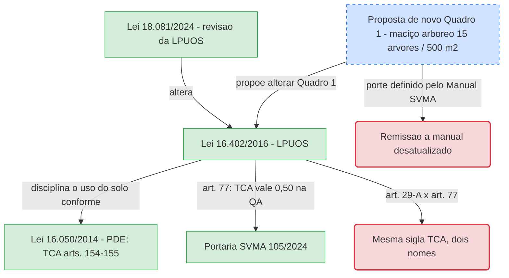

# Lei Municipal 16.402/2016 — Parcelamento, uso e ocupação do solo (LPUOS)

**Resumo**: Lei de zoneamento de São Paulo. Para a arborização, importa em quatro pontos: a Quota Ambiental (QA), que dá desconto parcial às árvores plantadas por TCA; a regra "uma árvore a cada 50 m² de área permeável"; a exigência de parecer ambiental no parcelamento de áreas com vegetação arbórea; e as ZEPAM. Profundamente alterada pela Lei 18.081/2024.

**Fontes**:
- raw/legislacao/Lei 16402-2016.pdf (texto consolidado do portal, impresso em 10/09/2026)
- https://legislacao.prefeitura.sp.gov.br/lei-16402-de-22-de-marco-de-2016
- raw/legislacao/Quadro 1 – Conceitos e definições.pdf (proposta de alteração do Quadro 1 — ver seção própria)

**Última atualização**: 2026-09-23

---

## Identificação

- **Número**: 16.402, de 22/03/2016 (Projeto de Lei 272/15, do Executivo, aprovado na forma de Substitutivo do Legislativo)
- **Autoria**: Poder Executivo (Prefeito Fernando Haddad); aprovada pela Câmara em 02/03/2016
- **Status**: em vigor, com alterações extensas — a Lei 18.081/2024 incluiu ~146 dispositivos, deu nova redação a ~63 e revogou 6; há alterações menores pelas Leis 17.217, 17.853, 17.975, 18.177 e 18.209 (contagem de marcadores no texto consolidado — fonte: Lei 16402-2016.pdf)
- **Instância**: Câmara Municipal de São Paulo

## O que propõe (pontos que tocam a arborização)

Fonte de todos os itens: Lei 16402-2016.pdf.

- **ZEPAM (art. 19)** — Zonas Especiais de Proteção Ambiental: áreas com Mata Atlântica, "arborização de relevância ambiental", **vegetação significativa**, permeabilidade alta e nascentes. Admite Pagamento por Serviços Ambientais (§1º). Ver [[vegetacao-significativa]].
- **Clubes que se extinguem (art. 29-A, incluído pela Lei 18.081/2024)** — áreas AC-1/AC-2 passam aos parâmetros da zona vizinha **desde que mantidas a permeabilidade e a vegetação de porte arbóreo**. §3º: a supressão pontual autorizada gera "**TCA — Termo de Compensação Ambiental**", com contrapartida **exclusivamente em plantio de mudas** (sem conversão em dinheiro ou obras).
- **Loteamento (art. 48, §3º)** — calçadas das novas vias com **arborização implantada**, segundo espaçamento e espécies fixados pelo órgão ambiental.
- **Parcelamento em área com vegetação arbórea (art. 52, §2º)** — o órgão ambiental emite parecer sobre o enquadramento na legislação de proteção, a localização das áreas verdes e "a **melhor alternativa para mínima destruição** da vegetação de porte arbóreo".
- **Recuo maior para preservar árvore (art. 71, §7º, incluído pela Lei 18.081/2024)** — admite recuo superior ao mínimo se houver "vegetação arbórea significativa a critério de SVMA".
- **Quota Ambiental (arts. 74-80)** — índice por lote que combina Cobertura Vegetal (V) e Drenagem (D): `QA = V^alfa × D^beta` (art. 75); exigida no licenciamento de edificação nova ou reforma com acréscimo > 20% (art. 76). Lotes até 500 m² são isentos (art. 76, §2º).
  - **Art. 77** — árvores plantadas como contrapartida de **TCA** recebem **fator redutor 0,50** no Fator de eficácia ambiental da Cobertura Vegetal (FV): contam só **metade** para a QA.
  - **Art. 78** — árvores plantadas por **TAC** (dano por manejo não autorizado) **não contam** para a QA.
- **Taxa de permeabilidade (art. 81)** — mínima por perímetro; **§4º (incluído pela Lei 18.081/2024): "deverá ser plantada uma árvore a cada 50 m² de área permeável** utilizada no projeto", no recuo de frente quando exigido.

## Dispositivos úteis para o movimento

- **Art. 52, §2º, III** — em todo parcelamento sobre área arborizada, o parecer ambiental tem de apontar a **alternativa de mínima destruição**. Parecer que não compara alternativas é impugnável.
- **Art. 78** — plantio feito para reparar corte ilegal não pode ser reaproveitado para cumprir a QA: evita que o infrator "ganhe duas vezes" com a mesma muda.
- **Art. 77** — plantio de compensação (TCA) vale só metade na QA; o empreendedor não pode usar a compensação como atalho para a exigência ambiental do lote.
- **Art. 81, §4º** — regra objetiva e verificável em planta: 1 árvore / 50 m² de área permeável.
- **Art. 71, §7º** — base para pedir recuo maior e preservar árvore significativa no alinhamento.

## Pontos de atenção ou lacunas

- **Duas expansões para a mesma sigla "TCA".** O art. 29-A, §3º (2024) diz "Termo de **Compensação** Ambiental"; o art. 77 da própria lei, a Lei 16.050/2014 (PDE) e a Portaria SVMA 105/2024 dizem "Termo de **Compromisso** Ambiental". A mesma lei usa dois nomes para o mesmo instrumento — falha de [[legistica-formal]] e de coerência (ver [[legisprudencia]]). Ver [[termo-de-compromisso-ambiental-tca]].
- **Regime especial de compensação no art. 29-A, §3º.** Nas áreas de clube, o TCA só aceita plantio de mudas — regra mais protetiva que a geral da Portaria SVMA 105/2024, que admite conversão em FEMA, viveiro ou obras pela CTCA. Não está claro se a SVMA aplica essa restrição. `[verificar]`.
- **"Vegetação arbórea significativa a critério de SVMA"** (art. 71, §7º) — expressão diferente de "vegetação significativa" (termo definido na Lei 17.794/2022, arts. 4º-5º). O "a critério" abre discricionariedade sem parâmetro.
- **Origem do "art. 143".** A wiki associava um "art. 143" à transferência de potencial construtivo em ZEPAM. A referência vem da Portaria SVMA 105/2024, art. 1º, IX, que cita o "Artigo 143 da Lei nº 16.050/14" (o PDE, não esta lei). E a remissão da Portaria está errada: o art. 143 do PDE trata de CEPAC em operação urbana; a transferência de potencial construtivo está nos arts. 122 a 133 do PDE, e a hipótese de TCA em ZEPAM no **art. 154, IV**. Nesta lei, o art. 143 trata de interdição. Ver [[portaria-svma-105-2024]] e [[termo-de-compromisso-ambiental-tca]].
- **Quadros e mapas fora do texto.** Os Quadros 1, 3A, 3B e 3C (conceitos, pontuação e fatores da QA) são anexos em PDF, não ingeridos. `[verificar]` os valores de FV para árvore plantada e existente no Quadro 3B vigente.

## Proposta de alteração do Quadro 1 (conceitos e definições)

O arquivo `Quadro 1 – Conceitos e definições.pdf` traz o título "PROPOSTA DE ALTERAÇÃO DO ANEXO INTEGRANTE DA LEI Nº 16.402, DE 22 DE MARÇO DE 2016". `[verificar]` a origem (qual projeto de lei; se é o que resultou na Lei 18.081/2024) e se foi aprovada. Definições que interessam à arborização (fonte: Quadro 1 – Conceitos e definições.pdf):

- **Maciço arbóreo** — "agrupamento com no mínimo **15 árvores** de espécies nativas ou exóticas [...] com área mínima de **500 m²** de projeção contínua de copa". Primeira definição objetiva de "maciço" encontrada na malha. Contrasta com o limiar de **1.000 m²** de "maciço contínuo" do Decreto Estadual 39.743/1994. Ver [[decreto-estadual-30443-1989]].
- **DAP** — diâmetro do caule a ~1,3 m do solo (mesma medida da Lei 17.794/2022, art. 1º).
- **Indivíduo arbóreo a ser plantado** — muda com **DAP = 3 cm**, porte pequeno, médio ou grande pelo Manual Técnico de Arborização da SVMA; as definições separadas de "porte médio" e "porte pequeno" aparecem como **"EXCLUÍDO"** (a proposta as funde numa só).
- **Indivíduo arbóreo existente** — três classes por DAP: 20-30 cm (pequeno), 30-40 cm (médio), > 40 cm (grande), todas pelo Manual Técnico de Arborização (3ª edição) "ou regulamentação que venha a alterá-lo".
- **Palmeira existente** — DAP > 10 cm.

**Ponto de atenção:** a proposta ancora a classificação de porte no **Manual Técnico de Arborização da SVMA**, que a wiki já mostrou estar desatualizado quanto à base legal (ver [[arborizacao-urbana]]). Uma lei de zoneamento dependendo de um manual técnico sem força normativa própria é remissão frágil.

## Atores envolvidos

- **Poder Executivo municipal** — autor do PL 272/15 e da revisão de 2024.
- **Câmara Municipal de SP** — aprovou substitutivo em 2016 e a revisão (Lei 18.081/2024).
- **SVMA** — pareceres ambientais no parcelamento (art. 52, §2º) e critério de "vegetação arbórea significativa" (art. 71, §7º).

## Normas citadas

Lei 16.050/2014 (PDE), arts. 158 e seg. (PSA) e 275; Lei 17.844/2022 (AIU Setor Central); Lei 18.081/2024 e Leis 17.217, 17.853, 17.975, 18.177, 18.209 (alterações); Decreto 58.963/2019 (regulamenta AVP-1).

## Diagrama

## Páginas relacionadas

- [[termo-de-compromisso-ambiental-tca]]
- [[portaria-svma-105-2024]]
- [[compensacao-ambiental]]
- [[vegetacao-significativa]]
- [[calcada-verde]]
- [[decreto-estadual-30443-1989]]
- [[arborizacao-urbana]]
