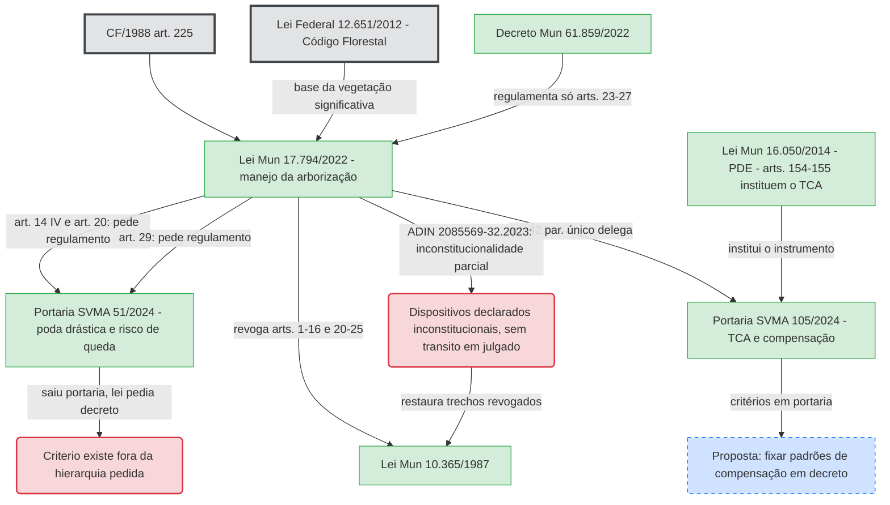

# Lei Municipal 17.794/2022 — Arborização urbana e manejo

**Resumo**: Lei que disciplina a arborização urbana de São Paulo quanto ao manejo (plantio, poda, supressão, transplante, urgência), classifica a vegetação de porte arbóreo como bem especialmente protegido e institui a categoria de "vegetação significativa". Fonte-semente desta análise.

**Fontes**:
- https://legislacao.prefeitura.sp.gov.br/lei-17794-de-27-de-abril-de-2022/consolidado
- https://www.saopaulo.sp.leg.br/assessoria_juridica/adin-no-2085569-32-2023-8-26-0000/

**Última atualização**: 2026-09-10

---

## Identificação

- **Número**: 17.794/2022 (Projeto de Lei 391/21, do Executivo)
- **Autoria**: Poder Executivo Municipal (Prefeito Ricardo Nunes). Aprovada pela Câmara Municipal em sessão de 4 de novembro de 2021; promulgada em 27 de abril de 2022.
- **Status**: em vigor (vacatio de 90 dias — art. 49), **com dispositivos declarados inconstitucionais pela ADIN nº 2085569-32.2023.8.26.0000** (TJSP, Órgão Especial, decisão **por maioria**, **ainda não transitada em julgado**).
- **Instância**: Câmara Municipal de São Paulo.
- **Regulamentação**: Decreto 61.859/2022 (apenas arts. 23 a 27, mais competências); "os demais dispositivos serão objeto de regulamentação própria" (Decreto 61.859/2022, art. 11). Ver [[decreto-61859-2022]].

## O que propõe

Estrutura em cinco capítulos (fonte: lei-17794-de-27-de-abril-de-2022/consolidado):

- **Cap. I — Vegetação de porte arbóreo.** Art. 1º: bem especialmente protegido, de interesse de todos os munícipes, em área pública e privada; DAP superior a 0,05 m medido a ~1,3 m do solo. Art. 2º: proprietário e possuidor respondem pela conservação. Art. 3º: levantamento arbóreo **decenal**.
- **Cap. II — Vegetação significativa** (ver [[vegetacao-significativa]]). Art. 4º: vegetação em APP (Lei Federal 12.651/2012). Art. 5º: também significativa a que proteja sítios de valor paisagístico/científico/histórico, a indicada em PLANPAVEL, PMSA, PMAU ou PMMA, ou a declarada por ato do Executivo (localização, raridade, antiguidade, porta-sementes). Art. 6º: supressão não autorizada não descaracteriza a área.
- **Cap. III — Manejo.** Art. 7º: manejo é toda intervenção do plantio ao fim do ciclo vital. Art. 8º: orientado por engenheiro agrônomo, engenheiro florestal **ou biólogo**; segue o PMAU. Art. 9º: conteúdo mínimo do laudo (identificação, **georreferenciamento**, croqui, justificativa, enquadramento legal, fotos, ART).
  - **Plantio (arts. 11-13):** em área pública **independe de autorização**; particular apenas comunica previamente.
  - **Supressão e transplante (arts. 14-17):** só autorizados nas hipóteses do art. 14 (I edificação; III fitossanitário; IV risco de queda; V dano permanente ao patrimônio com laudo de engenheiro civil e ART; VI obstáculo incontornável ao trânsito; VII propagação prejudicial; X plantio irregular pós-lei). Área privada: prévia autorização + manifestação técnica (art. 15). Área pública municipal: art. 16. Estadual/federal: art. 17.
  - **Poda (arts. 18-19):** em área não municipal, **comunicação prévia** + laudo + ART (art. 18) — não é mais autorização. Em área pública municipal, **independe de autorização prévia** (art. 19).
  - **Manejo de urgência (arts. 20-21):** risco de queda à vida, integridade ou patrimônio; supressão e poda sem prévia autorização; laudo entregue **após** a execução (até 1 dia útil — Decreto 61.859/2022, art. 2º, §2º). Não desobriga a reparação (art. 20, §4º).
- **Cap. IV — Infrações.** Multas por espécime: plantio irregular R$ 500 (art. 23); poda sem autorização/comunicação R$ 500 (art. 24); supressão/transplante sem autorização R$ 2.000 (art. 25); poda inadequada R$ 500 a R$ 5.000 (art. 28); **poda drástica** R$ 1.700 a R$ 17.000 (art. 29, "definida nos termos de regulamento"); supressão em desacordo R$ 2.000 a R$ 20.000 (art. 30); matar árvore R$ 4.000 a R$ 40.000 (art. 31). Atualização pelo IPCA-E (art. 34). Dosimetria (arts. 37-41): sanção-base por grau de ameaça da espécie, relevância ambiental/social/cultural, motivos, DAP e consequências (art. 38).
- **Cap. IV, Seção V — Reparação.** Art. 42: o infrator repara integralmente os danos. **Art. 42, parágrafo único**: por ocasião da autorização de supressão/transplante e da comunicação de poda, inclusive urgência, o órgão municipal "deverá estabelecer **medidas compensatórias** a serem cumpridas pelo interessado, observando **padrões e parâmetros previamente disciplinados em regulamento**, independentemente de a conduta configurar ou não infração". Art. 43: espécimes suprimidos em área pública são substituídos pelo órgão municipal.
- **Cap. V — Disposições finais.** Art. 45: fiscalização pela SVMA, com apoio complementar da Guarda Civil Metropolitana (SAE). Art. 47: regulamentar em 90 dias. Art. 48: não se aplica a atividades agrícolas.

## Dispositivos úteis para o movimento

- **Art. 1º** — proteção especial alcança **área privada**; o corte sem autorização em qualquer terreno é ilícito.
- **Art. 14** — a supressão é **exceção**: fora das hipóteses taxativas, não pode ser autorizada.
- **Art. 5º + [[vegetacao-significativa]]** — árvore antiga, rara, porta-sementes ou de valor paisagístico tem proteção reforçada e cabe pedido de declaração por ato do Executivo.
- **Art. 6º** — cortar vegetação significativa sem autorização **não** libera o terreno: a classificação se mantém e a área deve ser recuperada.
- **Art. 20, §4º e art. 42** — mesmo o manejo de urgência gera dever de reparação e de compensação.
- **Art. 9º** — todo laudo precisa de georreferenciamento e ART; laudo sem esses elementos é impugnável.

## Pontos de atenção ou lacunas

- **Dispositivos declarados inconstitucionais pela ADIN nº 2085569-32.2023.8.26.0000** (TJSP, Órgão Especial, julgamento **procedente por maioria**, decisão **ainda não transitada em julgado** — fonte: saopaulo.sp.leg.br/assessoria_juridica/adin-...):
  - **Inteiro teor**: art. 14, II (supressão em terreno a lotear/desmembrar) e art. 14, IX (porte incompatível com o local);
  - **Expressão "e/ou"** do art. 14, VIII (espécies invasoras);
  - As expressões que excluíam a hipótese de urgência da exigência de manifestação técnica de agente municipal, nos arts. 15 (caput), 16 (caput) e 17 (caput);
  - A expressão **"independentemente de prévia autorização"** do art. 20, caput, e a expressão "ou não" do art. 20, §3º (manejo de urgência);
  - **O inciso I do art. 49, na parte em que revoga** o caput, a alínea "a", incisos 1 a 4, do §2º e os §§3º e 4º do **art. 4º**, e o caput e os §§1º e 3º do **art. 5º**, da Lei 10.365/1987 — **essa revogação foi declarada inconstitucional, o que restaura esses trechos da Lei 10.365/1987**. Ver [[lei-10365-1987]].
  - `[verificar]` o texto integral do acórdão e o andamento de eventual recurso, já que a decisão não é definitiva.
- **Regulamentação por portaria onde a lei pedia decreto.** O Decreto 61.859/2022 só regulamentou arts. 23 a 27. Os critérios de **"risco de queda"** (art. 14, IV e art. 20, §2º) e de **"poda drástica"** (art. 29) — que a lei manda o "Poder Executivo Municipal" definir "em regulamento" — acabaram na **Portaria SVMA 51/2024** (ato do Secretário), não em decreto do Prefeito. Ver [[decreto-61859-2022]] e [[portaria-svma-51-2024]].
- **Termos vagos sem parâmetro:** "obstáculo fisicamente incontornável ao trânsito de pedestres ou ao acesso de veículos" (art. 14, VI); "danos permanentes ao patrimônio" (art. 14, V); "estado fitossanitário que justifique a supressão" (art. 14, III). Todos dependem de laudo, sem critério objetivo na lei.
- **Compensação delegada a portaria.** O art. 42, parágrafo único, remete os critérios de compensação a "regulamento". Hoje eles estão na **Portaria SVMA 105/2024**, norma editada e alterável pelo próprio Secretário. Ver [[portaria-svma-105-2024]] e [[questionar-criterios-tca]].
- **Poda em área pública sem autorização (art. 19).** A poda de árvore de rua não passa por autorização prévia; o controle é só posterior. Lacuna de fiscalização preventiva a mapear.
- **Descompasso com o Manual Técnico da SVMA.** O Manual (3ª ed.) baseia-se na Lei 10.365/1987, revogada em parte por esta lei. Ver a tabela em [[arborizacao-urbana]].

## Atores envolvidos

- **SVMA** — Secretaria Municipal do Verde e do Meio Ambiente; autoriza o manejo de vegetação significativa, em parques e UCs, em terreno a edificar ou lotear, e o plantio de compensação (Decreto 61.859/2022, art. 3º).
- **Subprefeituras** — regra geral de autorização e recebimento de comunicação do manejo arbóreo (Decreto 61.859/2022, art. 2º); agentes vistores aplicam as multas dos arts. 23-27.
- **Guarda Civil Metropolitana (SAE)** — fiscalização complementar (art. 45).
- **Câmara Municipal de SP** — origem do PL 391/21.
- **Tribunal de Justiça de SP (Órgão Especial)** — ADIN nº 2085569-32.2023.8.26.0000, julgou procedente por maioria e declarou trechos da lei inconstitucionais; decisão ainda não transitada em julgado.

## Normas revogadas por esta lei (art. 49)

- **Lei 10.365/1987** — arts. 1º a 16 e 20 a 25. Ver [[lei-10365-1987]].
- **Lei 12.959/1999**.
- **Lei 13.646/2003**.
- **Lei 13.846/2004**.
- **Lei 14.676/2008**.
- **Lei 14.902/2009**.

## Normas citadas ou correlatas

Lei Federal 12.651/2012 (Código Florestal); Lei 16.642/2017 (Código de Obras e Edificações — COE); Decreto 61.859/2022; **Portaria SVMA 51/2024** (define poda drástica e risco de queda — ver [[portaria-svma-51-2024]]); **Portaria SVMA 105/2024** (TCA e compensação); Comunicado SVMA 1/2023 (ADIN); Portaria Conjunta SVMA/SMSU 1/2022; Portarias SVMA 3/2023, 29/2023, 127/2024; Portaria SMSUB 155/2024; Decretos 64.883/2025 e 64.986/2026 (alteram o Decreto 61.859/2022). `[verificar]` o objeto de 3/2023, 29/2023, 127/2024 e da Portaria SMSUB 155/2024.

## Diagrama



## Bloco Cypher

```cypher
MERGE (n1:Norma {id: "MUN_LEI_17794_2022", tipo: "Lei", numero: "17794", ano: "2022", esfera: "Municipal", ementa: "Disciplina a arborização urbana quanto ao seu manejo"})
MERGE (n2:Norma {id: "MUN_LEI_10365_1987", tipo: "Lei", numero: "10365", ano: "1987", esfera: "Municipal"})
MERGE (n3:Norma {id: "MUN_DECRETO_61859_2022", tipo: "Decreto", numero: "61859", ano: "2022", esfera: "Municipal", ementa: "Competências para manejo arbóreo; regulamenta arts. 23 a 27 da Lei 17.794/2022"})
MERGE (n4:Norma {id: "FED_LEI_12651_2012", tipo: "Lei", numero: "12651", ano: "2012", esfera: "Federal", ementa: "Código Florestal"})
MERGE (n5:Norma {id: "MUN_PORTARIA_SVMA_105_2024", tipo: "Portaria", numero: "105", ano: "2024", esfera: "Municipal", ementa: "Critérios e procedimentos de compensação ambiental e TCA"})
MERGE (n6:Norma {id: "MUN_LEI_16050_2014", tipo: "Lei", numero: "16050", ano: "2014", esfera: "Municipal", ementa: "Plano Diretor Estratégico; institui o TCA (arts. 154-155)"})
MERGE (n7:Norma {id: "MUN_PORTARIA_SVMA_51_2024", tipo: "Portaria", numero: "51", ano: "2024", esfera: "Municipal", ementa: "Define poda drástica e critérios de urgência (risco de queda)"})
MERGE (a1:AtoRegulatorio {id: "TJSP_ADIN_2085569_2023", tipo: "ADIN", numero: "2085569-32.2023.8.26.0000", ano: "2023"})
MERGE (o1:Orgao {nome: "SVMA"})
MERGE (o2:Orgao {nome: "Subprefeituras"})
MERGE (c1:Conceito {termo: "Vegetação significativa"})
MERGE (c2:Conceito {termo: "Manejo de urgência"})
MERGE (c3:Conceito {termo: "Termo de Compromisso Ambiental"})
MERGE (c4:Conceito {termo: "Risco de queda"})
MERGE (n1)-[:REVOGA]->(n2)
MERGE (n3)-[:REGULAMENTA]->(n1)
MERGE (n4)-[:IMPACTA_INDIRETAMENTE]->(c1)
MERGE (n1)-[:VINCULADO_A]->(c1)
MERGE (n1)-[:VINCULADO_A]->(c2)
MERGE (n6)-[:VINCULADO_A]->(c3)
MERGE (n5)-[:REGULAMENTA]->(n1)
MERGE (n1)-[:VAGO_EM]->(c4)
MERGE (a1)-[:IMPACTA_INDIRETAMENTE]->(n1)
MERGE (o1)-[:FISCALIZA]->(c1)
MERGE (o2)-[:FISCALIZA]->(c2)
MERGE (n7)-[:REGULAMENTA]->(n1)
MERGE (n7)-[:VAGO_EM]->(c4);
```

## Páginas relacionadas

- [[vegetacao-significativa]]
- [[decreto-61859-2022]]
- [[portaria-svma-51-2024]]
- [[portaria-svma-105-2024]]
- [[termo-de-compromisso-ambiental-tca]]
- [[questionar-criterios-tca]]
- [[lei-10365-1987]]
- [[arborizacao-urbana]]
- [[manejo-arboreo]]
- [[poda]]
