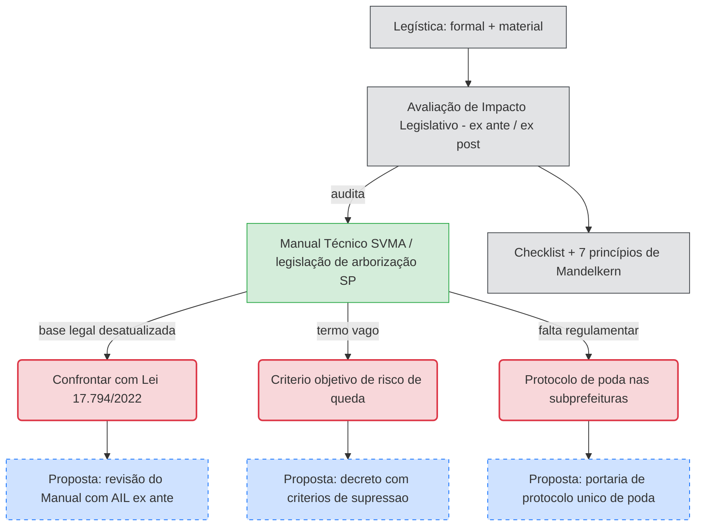

# Aplicar a AIL à legislação de arborização de São Paulo

**Resumo**: Página-ponte entre os dois eixos do projeto. Usa a [[legistica]] e a [[avaliacao-de-impacto-legislativo]] como método para auditar a legislação atual de arborização (Eixo 1) e desenhar propostas de aperfeiçoamento (Eixo 2).

**Fontes**:
- raw/legistica/A Legística como estratégia para a melhoria normativa_Edição_final.pdf
- raw/legistica/AVALIAÇÃO DE IMPACTO LEGISLATIVO NO BRASIL_ALESP_2010.pdf
- raw/legistica/artigo02.pdf
- raw/legistica/NOCOES_ELEMENTARES_DE_LEGISTICA.pdf
- raw/arborização/Arborização Manual Técnico de SVMA.pdf

**Última atualização**: 2026-09-10

---

## Por que esta página existe

As seis fontes de legística em `raw/` são método, não legislação de arborização. Esta página conecta o método aos objetos já analisados: a lei-semente [[lei-17794-2022]], o [[decreto-61859-2022]] e a [[portaria-svma-105-2024]]. A primeira análise aplicada está em [[questionar-criterios-tca]].

## Roteiro de auditoria (Eixo 1 — ex post)

Para cada norma ou dispositivo de arborização de São Paulo, aplicar o [[checklist-legislativo]] e os [[principios-da-legistica]]:

1. **Problema e objetivo** — o dispositivo declara o problema que enfrenta e o objetivo que persegue? (racionalidade instrumental)
2. **Necessidade** — a exigência é indispensável ou há meio mais simples? (princípio da necessidade)
3. **Clareza** — os termos são precisos? Marcar em vermelho/laranja termos vagos e ambíguos. (racionalidade linguística, princípio da inteligibilidade)
4. **Regulamentação** — o dispositivo depende de decreto ou portaria que não existe? Marcar como lacuna. (racionalidade sistemático-normativa)
5. **Fiscalização** — há protocolo, prazo e responsável definidos? Cruzar com dados de emissão de TCA. (racionalidade social)
6. **Efetividade** — há evidência de que o comportamento dos destinatários mudou? (avaliação ex post)

## Lacunas e ambiguidades já mapeadas

| Achado | Origem | Página |
|---|---|---|
| Manual Técnico da SVMA (3ª ed.) apoia-se em normas revogadas (Lei 10.365/1987, arts. 1º-16 e 20-25; Decretos de calçada 45.904/2005 e 52.903/2012) | Manual + Lei 17.794/2022, art. 49 | [[arborizacao-urbana]], [[lei-10365-1987]], [[calcada-verde]] |
| "Risco de queda" (art. 14, IV e art. 20 da Lei 17.794) sem regulamento, embora a lei mande o Executivo defini-lo | lei-17794-...-2022/consolidado + decreto-61859-...-2022/consolidado | [[lei-17794-2022]], [[manejo-arboreo]] |
| "Poda drástica" (art. 29) sem regulamento; multa de R$ 1.700 a R$ 17.000 | lei-17794-...-2022/consolidado | [[poda]] |
| Dispositivos da Lei 17.794/2022 com eficácia suspensa desde 2023 pela ADIN nº 2085569-32.2023.8.26.0000 | lei-17794-...-2022/consolidado | [[lei-17794-2022]] |
| Critérios de compensação/TCA fixados por portaria (105/2024), alterável pelo Secretário; remissão a artigo revogado da Lei 10.365/87 no Anexo VIII | portaria-...-105-...-2024/consolidado | [[questionar-criterios-tca]], [[portaria-svma-105-2024]] |
| Multiplicadores de compensação (Tabelas V, VI; fator 5,35) sem memória de cálculo pública | portaria-...-105-...-2024/consolidado | [[questionar-criterios-tca]] |
| Competência de autorização pulverizada em 32 subprefeituras + SVMA, sem garantia de critério uniforme | decreto-61859-...-2022/consolidado | [[decreto-61859-2022]] |
| Base de dados aberta de TCAs emitidos não localizada | — | [[termo-de-compromisso-ambiental-tca]] |

## Propostas de aperfeiçoamento (Eixo 2 — ex ante)

- Atualizar o Manual Técnico da SVMA para a base legal vigente (Lei 17.794/2022; Decreto 61.859/2022) e submeter a nova versão a uma AIL *ex ante*.
- Fixar por decreto ou portaria critérios objetivos e verificáveis para supressão (percentual de oco, ângulo de inclinação, índice fitossanitário).
- Instituir protocolo único de poda para as subprefeituras, com prazo de resposta e registro no sistema de gestão.
- Vincular toda autorização de manejo a registro público rastreável, para permitir avaliação *ex post* da efetividade.

Toda proposta deve responder ao [[checklist-legislativo]] antes de virar minuta.

## Diagrama

## Grafo interativo

<iframe src="../assets/grafos/aplicar-ail-legislacao-arborizacao.htm" width="100%" height="600px" frameborder="0"></iframe>

## Páginas relacionadas

- [[legistica]]
- [[avaliacao-de-impacto-legislativo]]
- [[principios-da-legistica]]
- [[checklist-legislativo]]
- [[lei-17794-2022]]
- [[decreto-61859-2022]]
- [[portaria-svma-105-2024]]
- [[questionar-criterios-tca]]
- [[termo-de-compromisso-ambiental-tca]]
- [[vegetacao-significativa]]
- [[arborizacao-urbana]]
- [[manejo-arboreo]]
- [[poda]]
- [[calcada-verde]]
- [[compensacao-ambiental]]
- [[consolidacao-leis-ambientais-alesp]]
