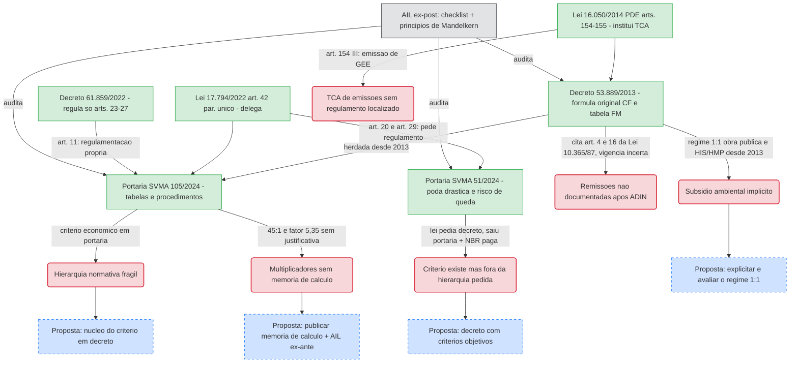

# Questionar os critérios de determinação do TCA

**Resumo**: Análise legística (AIL ex-post) dos critérios que hoje determinam a compensação ambiental e o Termo de Compromisso Ambiental em São Paulo, a partir da lei-semente 17.794/2022 e da Portaria SVMA 105/2024. Identifica fragilidades e propõe aperfeiçoamentos (Eixo 2).

**Fontes**:
- https://legislacao.prefeitura.sp.gov.br/lei-17794-de-27-de-abril-de-2022/consolidado
- https://legislacao.prefeitura.sp.gov.br/decreto-61859-de-3-de-outubro-de-2022/consolidado
- https://legislacao.prefeitura.sp.gov.br/portaria-secretaria-municipal-do-verde-e-do-meio-ambiente-svma-105-de-14-de-novembro-de-2024/consolidado
- https://legislacao.prefeitura.sp.gov.br/portaria-secretaria-municipal-do-verde-e-do-meio-ambiente-130-de-12-de-outubro-de-2013/revogado-por
- https://www.saopaulo.sp.leg.br/assessoria_juridica/adin-no-2085569-32-2023-8-26-0000/
- https://legislacao.prefeitura.sp.gov.br/lei-16050-de-31-de-julho-de-2014/consolidado
- https://legislacao.prefeitura.sp.gov.br/portaria-secretaria-municipal-do-verde-e-do-meio-ambiente-svma-51-de-21-de-junho-de-2024/consolidado
- raw/legislacao/Decreto Municipail 53.889-2013.pdf
- raw/legislacao/Portaria SVMA 116-2024.pdf
- raw/legistica/AVALIAÇÃO DE IMPACTO LEGISLATIVO NO BRASIL_ALESP_2010.pdf
- raw/legistica/NOCOES_ELEMENTARES_DE_LEGISTICA.pdf

**Última atualização**: 2026-09-10

---

## A estrutura documental do TCA hoje

O "critério de determinação do TCA" não está numa norma só. Ele resulta de uma pilha de seis níveis:

| Nível | Norma | O que fixa |
|---|---|---|
| Lei orgânica do instrumento | **Lei 16.050/2014 (PDE), arts. 154-155** | institui o TCA para 4 hipóteses (supressão, APP, emissão de GEE, transferência de potencial construtivo em ZEPAM); conversão em FEMA (art. 155) |
| Lei setorial (2022) | **Lei 17.794/2022, art. 42, § único** | exige "medidas compensatórias" pelo manejo arbóreo e delega os "padrões e parâmetros" a regulamento |
| Decreto de competências (2022) | **Decreto 61.859/2022** | regulamenta só arts. 23-27; art. 11: "os demais dispositivos serão objeto de regulamentação própria" |
| Decreto de base (2013, nunca substituído) | **Decreto 53.889/2013** | regulamenta o TCA da lei de 2002; contém, desde 2013, a fórmula `CF=(A+B+C+D+E+P+M)×Fr`, a tabela do Fator Multiplicador e o regime especial 1:1 (art. 7º) |
| Portaria de critérios (2024) | **Portaria SVMA 105/2024** (alt. 116/2024) | tabelas de proporção por DAP, procedimentos, documentos, prazos — reaproveita a fórmula e a tabela de 2013 |
| Tabela de preços | Decreto 53.889/2013, art. 4º, §3º-4º (valores de 2013, reajustados pelo Índice de Edificações em Geral) | valor monetário da muda e do tutor. `[verificar]` valor atual — **não é** o Decreto 64.877/2025 (preços genéricos de serviços da Prefeitura, sem menção a SVMA/arborização) |

Cruzam ainda a **Lei 16.402/2016** (Quota Ambiental), a **Portaria SVMA 51/2024** (padrão de muda) e a competência estadual (**CETESB**, Deliberação CONSEMA 01/2024). Ver [[lei-17794-2022]], [[decreto-61859-2022]], [[decreto-53889-2013]], [[portaria-svma-105-2024]], [[termo-de-compromisso-ambiental-tca]].

## Achados da AIL — Eixo 1

### 1. Hierarquia normativa frágil (legística formal — necessidade, segurança jurídica)

O núcleo do critério — quantas mudas se paga por árvore, com que fator, com que multiplicador — está numa **portaria**, ato unipessoal do Secretário, sem passagem pela Câmara nem por consulta pública obrigatória. A Lei 17.794/2022 apenas diz "observando padrões e parâmetros previamente disciplinados em regulamento" (art. 42, § único). Uma obrigação de conteúdo econômico relevante (dezenas a centenas de mudas por árvore, ou o equivalente em dinheiro ao FEMA) fixada por portaria tensiona o princípio da legalidade e a previsibilidade para o cidadão e para o empreendedor.

**Alerta:** o Decreto 61.859/2022, art. 11, confessa a regulamentação incompleta — mas passaram-se mais de dois anos até a Portaria 105/2024, e nesse intervalo valeu a Portaria 130/2013, ancorada em leis já revogadas.

### 2. Uma remissão à Lei 10.365/87 provavelmente válida, outra revogada — e ninguém documentou a diferença (racionalidade sistemático-normativa)

O **Decreto 53.889/2013, art. 5º, §2º**, enquadra o Fator Multiplicador citando o "**art. 4º**" e o "**art. 16**" da Lei 10.365/1987. Os dois foram formalmente revogados pela Lei 17.794/2022, art. 49, I (2022). Mas a **ADIN nº 2085569-32.2023.8.26.0000** (TJSP, Órgão Especial, por maioria, **decisão ainda não transitada em julgado**) declarou **inconstitucional** a revogação de parte do **art. 4º** (caput, alínea "a", incisos 1-4 do §2º, §§3º-4º) e do **art. 5º** (caput, §§1º e 3º) — exatamente o trecho que o Decreto 53.889/2013 cita para o Fator Multiplicador 3 e 2 (vegetação de preservação permanente). **Se a decisão se mantiver, essa citação está certa, não errada.**

Já a citação ao **art. 16** ("imune ao corte", Fator Multiplicador 2) não foi alcançada pela ADIN e segue revogada. A **Portaria SVMA 105/2024** (Anexo VIII) mostra evidência de correção parcial: o item que citava o art. 16 foi reescrito para citar o Decreto Estadual 30.443/1989 e o art. 5º da Lei 17.794/2022; os itens que citam o art. 4º permaneceram como no decreto de 2013.

O problema de legística aqui não é "citar norma revogada" — é que **nenhuma das três normas (Decreto 53.889/2013, Portaria 130/2013, Portaria 105/2024) documenta a ADIN ou explica por que manteve, ajustou ou removeu cada remissão**. Um jurista ou um técnico da SVMA precisa reconstruir esse histórico manualmente para saber o que está em vigor — exatamente o problema de acessibilidade e clareza que a legística formal existe para evitar. Ver [[lei-10365-1987]], [[decreto-53889-2013]] e [[portaria-svma-105-2024]].

### 3. Termos "regulamentados" — mas por portaria, não pelo decreto que a lei pediu (racionalidade sistemático-normativa)

**Correção desta análise:** uma leitura inicial classificou "risco de queda" e "poda drástica" como lacunas sem nenhum critério. A **Portaria SVMA 51/2024** mostra que ambos têm definição técnica objetiva — mas editada pelo Secretário, não pelo Prefeito em decreto, que é o que os arts. 20, §2º, e 29, § único, da Lei 17.794/2022 pedem ("regulamento" "editado pelo Poder Executivo Municipal"). Ver [[portaria-svma-51-2024]].

- **"Poda drástica"** (Portaria 51/2024, art. 2º, X) — definida objetivamente: ferimento sem cicatrização natural, desequilíbrio da árvore, corte fora do plano "crista/colar", ou **corte de 1/3 ou mais da copa**. Critério verificável, mas em portaria — tensiona a delegação legal, que pedia decreto.
- **"Risco de queda"** para manejo de urgência (Portaria 51/2024, art. 42) — exige laudo técnico com evidência objetiva, "a partir dos critérios... da **NBR ABNT 16.246-3:2019**" — uma norma técnica da ABNT, de acesso pago. O critério existe, mas depende de norma privada onerosa, não de texto público e gratuito — tensiona o princípio da acessibilidade.
- **"Valor ecológico do elemento verde"** — base do Fator Multiplicador (Portaria 105/2024, Anexo VIII, a). A tabela dá oito faixas, mas o enquadramento ("fragmento florestal em estágio de regeneração", "porção mais significativa da vegetação") depende de laudo e da "definição da DCRA" (art. 35, II), sem método publicado de classificação do estágio sucessional. **Esta permanece uma lacuna real.**
- **"Obstáculo fisicamente incontornável ao trânsito"** (Lei 17.794, art. 14, VI) — sem critério de largura, distância ou alternativa em nenhuma das normas lidas até agora. **Lacuna real.**
- **Poda em área privada** (Portaria 51/2024, art. 37) remete a "regulamento próprio" de cada Subprefeitura — risco de 32 critérios distintos. `[verificar]`.

### 4. Multiplicadores sem memória de cálculo pública (racionalidade instrumental — falta de AIL)

As Tabelas V e VI da Portaria 105/2024 saltam de 3:1 (DAP 5–10 cm) para 45:1 (DAP acima de 150 cm) por corte, em degraus não lineares. Não há documento público que justifique por que 45 e não 30 ou 60, nem como os multiplicadores se relacionam com a biomassa, a copa ou os serviços ecossistêmicos perdidos. O **fator 5,35** (art. 41) vem **intacto da Portaria 130/2013** (item 11.4), replicado por mais de uma década sem revisão publicada. Falta a "identificação clara do problema" e a "comparação de alternativas" que a AIL exige (fonte: AVALIAÇÃO DE IMPACTO LEGISLATIVO NO BRASIL_ALESP_2010.pdf).

### 5. Cálculo sobre "10% dos maiores DAP" pode subestimar o impacto

`Ic` e `It` são a **média aritmética dos 10% maiores DAP** dos exemplares a manejar, não o DAP de cada árvore. Num lote com poucas árvores grandes e muitas médias, a média dos 10% maiores pode ficar abaixo do impacto real do conjunto. É uma escolha metodológica de simplificação, sem justificativa documentada nem análise de sensibilidade.

### 6. Regime brando 1:1 para obra pública, HIS e HMP — subsídio ambiental implícito desde 2013

Para obra de infraestrutura, utilidade/interesse público ou social, HIS, HMP, PRAD e remediação, a compensação é `CF = F × Fm` (proporção 1:1), muito menor que o regime geral `(A+B+C+D+E+P+M) × Fr`. Um conjunto habitacional de interesse social que suprime 100 árvores nativas de grande porte compensa ~100 mudas × Fm; um edifício residencial comum compensaria várias centenas. A opção de favorecer habitação e obra pública **já estava no Decreto 53.889/2013, art. 7º**, e foi apenas repetida pela Portaria 105/2024 — 11 anos sem que a política fosse reavaliada ou seu custo ambiental publicado. É um subsídio ambiental invisível.

### 6-A. Hipótese de compensação por emissão de gases de efeito estufa sem regulamento localizado

A Lei 16.050/2014, art. 154, III, institui o TCA para licenciamento ambiental com significativa emissão de gases de efeito estufa, condicionado a um plano de mitigação "com critérios estabelecidos por Ato do Executivo" (§2º). Nem o Decreto 53.889/2013 nem a Portaria SVMA 105/2024 tratam dessa hipótese — ambos cobrem apenas manejo arbóreo e intervenção em APP. `[verificar]` se o "Ato do Executivo" para compensação de emissões foi editado; se não, é uma lacuna de regulamentação de 12 anos (desde a Lei 16.050/2014).

### 7. Decisão discricionária sem critério nem participação externa

A **Câmara Técnica de Compensação Ambiental (CTCA)** — cinco cargos internos da SVMA, sem assento externo (Portaria 105/2024, art. 32) — delibera a compensação excedente "em atenção a conveniência e oportunidade" (art. 33, §2º), escolhendo entre plantio externo, viveiro, FEMA e obras. Sem critério objetivo publicado nem transparência das pautas.

### 8. Sem avaliação ex-post do programa (racionalidade social)

A Portaria prevê vistorias e relatórios por processo, mas **nenhuma avaliação agregada** da política: quantas mudas plantadas por TCA, taxa de sobrevivência, balanço de cobertura arbórea por subprefeitura. O "levantamento arbóreo decenal" (Lei 17.794, art. 3º) tem periodicidade longa demais para monitorar a compensação. `[verificar]` a existência de base de dados aberta de TCAs emitidos.

### 9. Instabilidade normativa (princípio da acessibilidade)

Portaria 130/2013: revogada em parte (2016), revogada (2018), revogação tornada insubsistente (2018), revogada de novo (2024, por duas portarias). Portaria 105/2024 já alterada pela 116/2024 no mesmo ano. Decreto 61.859/2022 alterado em 2025 e 2026. A ADIN nº 2085569-32.2023.8.26.0000 mantém dispositivos da Lei 17.794 suspensos desde 2023. Para quem quer contestar um corte, o quadro normativo muda de ano a ano.

## Propostas de aperfeiçoamento — Eixo 2

1. **Elevar o núcleo do critério para decreto.** Migrar as fórmulas, tabelas e fatores da Portaria 105/2024 para um decreto autônomo de compensação, deixando à portaria apenas parâmetros operacionais (padrão de muda, prazos, modelos de planta).
2. **Publicar a memória de cálculo** dos multiplicadores das Tabelas V, VI e do fator 5,35, com base em métrica ecológica (biomassa, área de copa, serviços ecossistêmicos) e submetê-la a AIL ex-ante.
3. **Elevar a portaria a decreto** nos pontos em que a Lei 17.794/2022 pediu "regulamento do Poder Executivo Municipal" — "risco de queda" (art. 20) e "poda drástica" (art. 29), hoje na Portaria SVMA 51/2024 — e substituir a remissão à NBR ABNT paga por um resumo público dos critérios. Criar, por decreto, parâmetro objetivo para "obstáculo fisicamente incontornável ao trânsito" e para o "valor ecológico" do Fator Multiplicador.
4. **Tornar explícito o regime 1:1** para obra pública e HIS/HMP como decisão de política, com avaliação do custo ambiental que representa e de um teto de espécimes.
5. **Abrir a CTCA** a assento da sociedade civil e do CADES, com pauta e ata públicas e critério objetivo de escolha entre plantio, viveiro, FEMA e obras.
6. **Instituir relatório anual público de compensação** por subprefeitura, com número de TCAs, mudas exigidas, plantadas e sobreviventes, e balanço de cobertura arbórea — dado aberto.
7. **Consolidar** a legislação de arborização e compensação num diploma único, atacando a pilha de seis níveis (Decreto 53.889/2013 incluído). Ver [[consolidacao-leis-ambientais-alesp]].
8. **Documentar o efeito da ADIN nº 2085569-32.2023.8.26.0000** em cada norma que cita a Lei 10.365/1987 (Decreto 53.889/2013, Portaria 105/2024), explicitando quais remissões seguem válidas e quais estão revogadas, e acompanhar o trânsito em julgado.
9. **Editar o "Ato do Executivo"** previsto no art. 154, §2º, da Lei 16.050/2014 para a compensação por emissão de gases de efeito estufa, ou confirmar e documentar publicamente que essa hipótese de TCA está sem regulamentação.

## Diagrama

## Grafo interativo

<iframe src="../assets/grafos/questionar-criterios-tca.htm" width="100%" height="600px" frameborder="0"></iframe>

## Páginas relacionadas

- [[legistica]]
- [[avaliacao-de-impacto-legislativo]]
- [[principios-da-legistica]]
- [[checklist-legislativo]]
- [[lei-17794-2022]]
- [[decreto-61859-2022]]
- [[decreto-53889-2013]]
- [[portaria-svma-105-2024]]
- [[portaria-svma-51-2024]]
- [[portaria-svma-130-2013]]
- [[termo-de-compromisso-ambiental-tca]]
- [[aplicar-ail-legislacao-arborizacao]]
